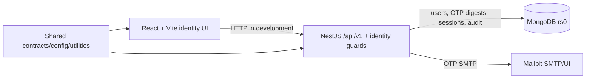

# Maintained architecture

## Current implementation through Phase 3

The implementation follows [ADR 0001](adr/0001-modular-monolith.md): a pnpm TypeScript modular monorepo with a React browser app and NestJS modular API. MongoDB is the canonical database and Mailpit captures development email. Phase 2 adds the identity boundary and global fail-closed guards. Phase 3 adds a question-bank module with immutable content versions, separately encrypted rubrics, transactional audit writes, private provider-neutral media, and shared question contracts. The detailed security architecture remains in [Phase 0](phase-0/02-architecture.md).

The API sends authentication mail through a bounded SMTP adapter and persists identity records in dedicated MongoDB collections. Notification durability remains Phase 9 scope.

## Module boundaries

- `apps/web`: browser presentation, routing, query state, build/static delivery.
- `apps/api`: HTTP bootstrap, cross-cutting request controls, health/platform/identity modules, migration, bootstrap, and seed commands.
- `packages/contracts`: API-neutral runtime schemas/types.
- `packages/config`: runtime environment schemas for API/browser.
- `packages/shared`: framework-independent utilities.
- `infra`: container/runtime initialization only; no business logic.

The browser remains untrusted. It cannot determine authorization, account state, session validity, academic state, timing, persistence, or results. Its account-management controls only invoke server-authorized APIs.

## Health semantics

- `GET /api/v1/health/live`: confirms the Node/Nest process can respond and returns 200 independently of MongoDB.
- `GET /api/v1/health/ready`: returns 200 only when required configuration and MongoDB are ready; otherwise 503.
- OpenAPI is enabled by configuration for development. Production policy will restrict or disable it as appropriate.

## Dependency compatibility

The project uses TypeScript 6.0.3 because typescript-eslint 8.65.0 declares support below TypeScript 6.1. Mongoose remains on 8.24.1 because NestJS Mongoose 11.0.4 declares Mongoose 7/8 support. These are deliberate “latest supported” choices, not accidental outdated dependencies.

## Next architectural increment

Phase 3 may add question and media modules only after explicit user authorization. It must retain the global identity guards and keep correct-answer data outside student serializers.
