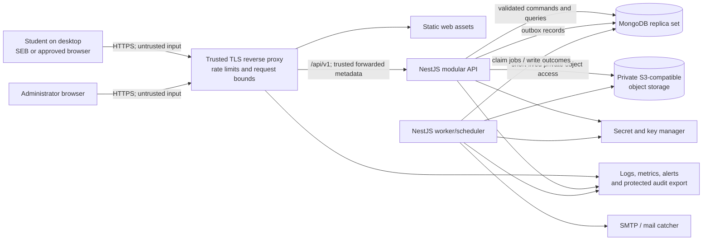
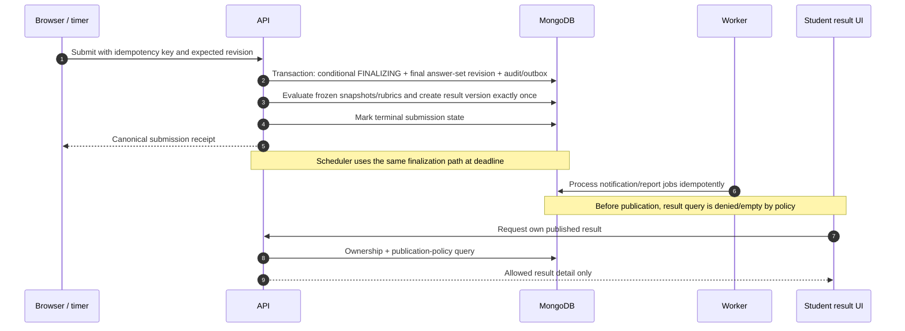

# Data-flow design

## System context and trust boundaries



Everything before the reverse proxy, including SEB/browser state, is untrusted. The proxy is trusted only for TLS and forwarding metadata when traffic originates from its allowlisted addresses. Application identities have scoped database/storage/key permissions. Public networks cannot reach data services directly.

## OTP authentication flow

```mermaid
sequenceDiagram
    autonumber
    participant B as Browser
    participant A as API
    participant D as MongoDB
    participant W as Mail worker
    participant M as SMTP
    B->>A: Request OTP (email, CSRF bootstrap context)
    A->>A: Normalize; domain/global/IP/account-key rate checks
    A->>D: Invalidate old challenge; save hashed OTP + expiry + outbox
    A-->>B: Generic accepted response
    W->>D: Claim outbox idempotently
    W->>M: Send minimal OTP message
    W->>D: Record provider outcome (never OTP in logs)
    B->>A: Verify email + OTP + CSRF/origin evidence
    A->>D: Atomic attempt count / expiry / single-use verification
    A->>D: Rotate/create hashed server session; enforce concurrency; audit
    A-->>B: Set opaque HttpOnly cookie; generic success/failure
```

The mail job necessarily needs the plaintext OTP briefly. It is passed in an encrypted/short-lived job payload or generated/sent in a tightly bounded application path; it is never stored in ordinary logs. Phase 2 must choose and threat-model the exact handoff. The database retains only a verifier.

## Exam start and fixed randomization

```mermaid
sequenceDiagram
    autonumber
    participant B as SEB / browser
    participant A as Attempt API
    participant D as MongoDB
    B->>A: Authorize (public exam ID, password, idempotency key, SEB evidence)
    A->>A: Session, CSRF, origin, eligibility, schedule, rate checks
    A->>A: Validate official SEB request hash or audited fallback grant
    A->>D: Transaction: compare active session/attempt and password gate
    A->>A: CSPRNG seed; deterministic selection/order from frozen version
    A->>D: Create attempt + question snapshots + device binding + audit
    D-->>A: Committed attempt/deadlines/revision
    A-->>B: Candidate-safe instances, server time, deadlines, lease
```

No correct-answer data crosses to the browser. An idempotent retry returns the same attempt and order.

## Answer save and bounded reconnect

```mermaid
sequenceDiagram
    autonumber
    participant I as IndexedDB queue
    participant B as Exam UI
    participant A as Answer API
    participant D as MongoDB
    B->>I: Append operation before network attempt
    B->>A: Save (sequence, expected revision, lease ref, idempotency key)
    A->>A: Validate ownership/device/state/deadline/server receipt time
    A->>D: Conditional monotonic update + event/audit as required
    D-->>A: Canonical revision and server receipt time
    A-->>B: Durable acknowledgement
    B->>I: Remove acknowledged operation
    Note over B,A: On disconnect, UI may queue only within displayed lease window
    B->>A: Sync ordered batch before server lease expiry
    A->>D: Validate batch once; apply operations in sequence transactionally
    A-->>B: Per-op accepted/duplicate/conflict/rejected + canonical state
```

If the reconnect reaches the server after lease expiry, client timestamps do not rescue queued operations. They are quarantined locally for support evidence, the UI stops new answers, and the server returns a recovery-required state.

## Submission, evaluation, and publication



## Data classification and flow rules

| Class                      | Examples                                                           | Browser                                                                                    | Logs/audit                     | Storage                                              |
| -------------------------- | ------------------------------------------------------------------ | ------------------------------------------------------------------------------------------ | ------------------------------ | ---------------------------------------------------- |
| Restricted academic secret | Correct answers, rubrics, exam password verifier, SEB key material | Never; except allowed post-publication answer view from a separately authorized projection | Never raw                      | Application-encrypted / hashed with key IDs          |
| Restricted authentication  | OTP plaintext, session token, CSRF secret, crypto keys             | OTP input and opaque cookies only                                                          | Never raw                      | Hash/verifier; keys in secret manager                |
| Confidential academic      | Candidate answers, unpublished questions, scores, attempt order    | Only owning candidate's needed subset/admin-authorized view                                | Metadata, not body             | Encrypted transport/storage, strict access/retention |
| Personal/security          | Name, email, roll, IP, user-agent summary, suspicious events       | Minimum needed                                                                             | Redacted and access-controlled | Retention-controlled                                 |
| Public/configurable        | Published instructions, system-check documentation                 | Yes                                                                                        | Yes                            | Normal controls                                      |

## Failure behavior

- Database unavailable: readiness fails; no save is acknowledged; UI remains pending/offline according to lease.
- Audit/outbox write failure during critical transition: transaction fails and caller receives retryable error; do not claim success.
- Email unavailable: authentication requests remain generic; durable job retries. Operational alert indicates mail delay.
- Object storage unavailable: exam publication validation rejects broken required media; existing exam readiness must detect inaccessible objects before start.
- Worker unavailable: API saves continue; scheduler redundancy/monitoring must ensure server deadline finalization is not missed. Submission endpoints also enforce expiry on every request.
- Clock drift: all app/database hosts use monitored time sync; drift beyond threshold removes instance readiness for exam operations.
