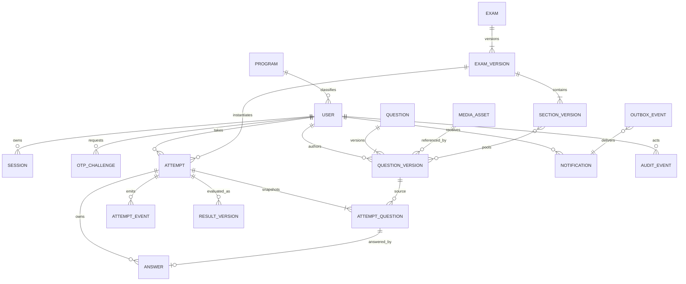

# MongoDB entity model and index plan

## Modeling principles

- Store timestamps as UTC BSON dates; store an exam's IANA timezone separately for display and policy provenance.
- Use MongoDB transactions for cross-document academic invariants; production and development run replica sets.
- Use application-generated opaque public IDs (`publicId`) at API boundaries. Mongo `_id` values stay internal.
- Published exam/question versions and attempt question snapshots are immutable.
- Normalize email/roll/search fields at write time. Uniqueness is enforced on canonical fields, not locale-sensitive display values.
- Enable strict Mongoose schemas, optimistic concurrency, explicit collection validators, and migration-owned indexes.
- Keep large append-only streams (audit/attempt events) separate from hot attempt documents.
- TTL only ephemeral operational records. Academic/legal retention uses explicit reviewed archival/deletion jobs.

## Entity relationship diagram

The diagram uses `SECTION_VERSION` as an embedded-or-separate logical entity. The initial recommendation is embedding sections/pool rules in `examVersions` because an exam version is immutable and read together, while attempt question instances remain separate for write/read scale.

## Collection design

| Collection                   | Key fields and invariants                                                                                                                                                                                    | Retention / mutability                                                                                              |
| ---------------------------- | ------------------------------------------------------------------------------------------------------------------------------------------------------------------------------------------------------------ | ------------------------------------------------------------------------------------------------------------------- |
| `programs`                   | `publicId`, canonical `code`, display name, active                                                                                                                                                           | Small reference collection; archive, do not reuse code ambiguously                                                  |
| `users`                      | `publicId`, normalized email, roll, full name, program ID, role set, status, security/session revision                                                                                                       | Mutable through audited admin workflows; retained per institutional policy                                          |
| `otpChallenges`              | hashed lookup/email key, OTP verifier, pepper/key version, purpose, expiry, attempt count, consumed/locked times, request metadata                                                                           | TTL after expiry plus safety margin; never plaintext OTP                                                            |
| `sessions`                   | hashed session token lookup, user ID, session/device public ID, role snapshot/security revision, created/last-seen/absolute expiry, revoked fields, step-up time                                             | TTL after expiry; explicit revocation remains visible through audit                                                 |
| `exams`                      | `publicId`, mutable draft pointer/current published version, lifecycle, created/updated actor                                                                                                                | Stable aggregate identity; archive rather than destructive delete                                                   |
| `examVersions`               | exam ID/version, frozen candidate-safe fields, encrypted/password verifier references, schedule/timing, program IDs, sections/pools, randomization/result policy, validation report/hash, author provenance  | Immutable after publication; no TTL                                                                                 |
| `questions`                  | `publicId`, current draft/version pointers, lifecycle, canonical search metadata                                                                                                                             | Stable identity; archive                                                                                            |
| `questionVersions`           | question ID/version, candidate-safe prompt/type/options/media, marks/tags, encrypted rubric envelope, validation hash, creator                                                                               | Immutable once referenced/published; no TTL                                                                         |
| `mediaAssets`                | `publicId`, owner, state, detected type/signature, size/dimensions/hash, private object/derived keys, scan/validation, timestamps                                                                            | Quarantine then active/archive; retention follows referencing records                                               |
| `attempts`                   | `publicId`, exam/version/user, attempt no., state, bound session/device, seed/encrypted seed if needed, start/deadlines, section state, revision/final revision, offline lease state, submission/termination | Academic record; optimistic concurrency; no TTL                                                                     |
| `attemptQuestions`           | attempt ID, instance public ID, source version, section/index, candidate-safe immutable snapshot, option order, scoring snapshot reference/encrypted envelope, max marks, snapshot hash                      | Immutable except review flag if stored here; no TTL                                                                 |
| `answers`                    | attempt/question instance, normalized answer payload, client sequence, device session, attempt/answer revision, client event time (informational), server receipt, idempotency reference                     | Updatable only while attempt permits; retain final and append history/events as policy requires                     |
| `answerOperations`           | attempt, device, idempotency key, sequence, payload hash, outcome/canonical revision/response digest, received time                                                                                          | Bounded operational dedup window; retain through dispute window, then explicit policy/optional TTL only if approved |
| `attemptEvents`              | attempt, monotonic event sequence, event type, server time, actor/device, safe metadata                                                                                                                      | Append-only academic event record; no automatic TTL                                                                 |
| `results` / `resultVersions` | stable result public ID; attempt; version; evaluation policy/version; totals/sections/question awards; grade; generated/published fields; supersedes                                                         | Immutable versions; publication pointer changes with audit; no TTL                                                  |
| `notifications`              | public ID, recipient/channel/template/data classification, status/read time/dedup                                                                                                                            | Retention configurable; content minimized                                                                           |
| `outboxEvents`               | aggregate/event/dedup IDs, payload envelope, available/lease/attempt/status/provider outcome                                                                                                                 | Delete/archive only after delivered plus operational retention; TTL only after terminal marker if approved          |
| `auditEvents`                | public/event ID, type, actor/role/target/attempt, server timestamp, request/IP/UA summary, outcome/reason/safe metadata, integrity link/batch                                                                | Append-only and separately permissioned; never TTL by default                                                       |
| `idempotencyKeys`            | scope/actor/key, request hash, status, response digest/body subset, resource ID, expiry                                                                                                                      | TTL after route-specific safe replay window; cannot be sole record of academic outcome                              |
| `migrations`                 | migration ID, checksum, applied time/version                                                                                                                                                                 | Append-only operational history                                                                                     |

## Index plan

Index names are explicit and migration-managed. Every proposed index must be checked with representative `explain()` output in later phases.

| Collection         | Index (keys; options)                                                                                                                                                          | Purpose                                                                           |
| ------------------ | ------------------------------------------------------------------------------------------------------------------------------------------------------------------------------ | --------------------------------------------------------------------------------- |
| `programs`         | `{ codeCanonical: 1 }`; unique                                                                                                                                                 | Program identity                                                                  |
| `users`            | `{ emailCanonical: 1 }`; unique                                                                                                                                                | Institute-email uniqueness/login lookup                                           |
| `users`            | `{ rollNumberCanonical: 1 }`; unique                                                                                                                                           | Roll uniqueness                                                                   |
| `users`            | `{ role: 1, status: 1, programId: 1, fullNameSearch: 1 }`                                                                                                                      | Admin filter; avoid unbounded regex                                               |
| `otpChallenges`    | `{ expiresAt: 1 }`; TTL `expireAfterSeconds: 0`                                                                                                                                | Ephemeral cleanup                                                                 |
| `otpChallenges`    | `{ emailKey: 1, purpose: 1, createdAt: -1 }` and `{ ipPrefixHash: 1, createdAt: -1 }`                                                                                          | Current challenge/rate checks without exposing email in logs                      |
| `sessions`         | `{ tokenHash: 1 }`; unique                                                                                                                                                     | Opaque cookie lookup                                                              |
| `sessions`         | `{ expiresAt: 1 }`; TTL                                                                                                                                                        | Ephemeral cleanup                                                                 |
| `sessions`         | `{ userId: 1, revokedAt: 1, expiresAt: 1 }`                                                                                                                                    | Active-session policy; concurrency also guarded transactionally/security revision |
| `exams`            | `{ publicId: 1 }`; unique                                                                                                                                                      | API identity                                                                      |
| `exams`            | `{ lifecycle: 1, updatedAt: -1 }`                                                                                                                                              | Admin listing                                                                     |
| `examVersions`     | `{ examId: 1, version: 1 }`; unique                                                                                                                                            | Immutable version identity                                                        |
| `examVersions`     | `{ lifecycle: 1, startAt: 1, endEntryAt: 1, allowedProgramIds: 1 }`                                                                                                            | Student schedule candidate set; authorization still filters                       |
| `questions`        | `{ publicId: 1 }`; unique; `{ lifecycle: 1, updatedAt: -1 }`                                                                                                                   | API identity/list                                                                 |
| `questionVersions` | `{ questionId: 1, version: 1 }`; unique                                                                                                                                        | Version identity                                                                  |
| `questionVersions` | approved Atlas Search or self-hosted Mongo text index on candidate-safe search fields; tags/difficulty/status compound                                                         | Admin search without rubric indexing; portability decision required               |
| `mediaAssets`      | `{ publicId: 1 }`; unique; `{ sha256: 1, detectedType: 1 }`; `{ state: 1, createdAt: 1 }`                                                                                      | Identity, dedup hint, quarantine operations                                       |
| `attempts`         | `{ publicId: 1 }`; unique                                                                                                                                                      | API identity                                                                      |
| `attempts`         | `{ examId: 1, userId: 1, attemptNumber: 1 }`; unique                                                                                                                           | Attempt limit identity                                                            |
| `attempts`         | `{ userId: 1, state: 1, updatedAt: -1 }` and `{ examVersionId: 1, state: 1, lastHeartbeatAt: 1 }`                                                                              | Dashboard/live monitoring/recovery                                                |
| `attempts`         | `{ boundSessionId: 1, state: 1 }`                                                                                                                                              | Device/session enforcement                                                        |
| `attemptQuestions` | `{ attemptId: 1, instancePublicId: 1 }`; unique; `{ attemptId: 1, sectionIndex: 1, displayIndex: 1 }`; unique                                                                  | Ownership/order and stable instance                                               |
| `answers`          | `{ attemptId: 1, attemptQuestionId: 1 }`; unique                                                                                                                               | One canonical current answer per instance                                         |
| `answers`          | `{ attemptId: 1, updatedAt: 1 }`                                                                                                                                               | Recovery/submission read                                                          |
| `answerOperations` | `{ attemptId: 1, deviceSessionId: 1, idempotencyKey: 1 }`; unique                                                                                                              | Replay deduplication                                                              |
| `answerOperations` | `{ attemptId: 1, deviceSessionId: 1, clientSequence: 1 }`; unique                                                                                                              | Monotonic stream uniqueness                                                       |
| `attemptEvents`    | `{ attemptId: 1, eventSequence: 1 }`; unique; `{ examId: 1, type: 1, occurredAt: 1 }`                                                                                          | Reproduction/attendance/operations                                                |
| `results`          | `{ publicId: 1 }`; unique; `{ attemptId: 1 }`; unique                                                                                                                          | Stable result aggregate                                                           |
| `resultVersions`   | `{ resultId: 1, version: 1 }`; unique; `{ examVersionId: 1, publishedAt: 1, userId: 1 }`                                                                                       | Version and authorized reporting                                                  |
| `notifications`    | `{ recipientId: 1, createdAt: -1 }`; `{ recipientId: 1, readAt: 1 }`; `{ dedupKey: 1 }` unique when present                                                                    | Inbox/unread/dedup                                                                |
| `outboxEvents`     | `{ dedupKey: 1 }`; unique; `{ status: 1, availableAt: 1, leaseUntil: 1 }`                                                                                                      | Exactly-once effect intent / worker claim                                         |
| `auditEvents`      | `{ eventId: 1 }`; unique; `{ actorId: 1, occurredAt: -1 }`; `{ targetType: 1, targetId: 1, occurredAt: -1 }`; `{ attemptId: 1, occurredAt: 1 }`; `{ type: 1, occurredAt: -1 }` | Authorized investigations and exports                                             |
| `idempotencyKeys`  | `{ scope: 1, actorId: 1, key: 1 }`; unique; `{ expiresAt: 1 }` TTL                                                                                                             | Request replay                                                                    |

Do not use a partial unique index whose predicate depends on `$ne`/time for “currently active” sessions; time does not automatically re-evaluate uniqueness and supported partial expressions are constrained. Enforce the active-session invariant with a user `securityRevision`/active session pointer and a transaction, plus indexes for lookup.

## Validation and concurrency

- Mongoose validation improves developer feedback; MongoDB `$jsonSchema` validators protect against bypass. Validation levels/actions are rollout-managed by migrations.
- Use discriminated answer and question content schemas. Reject unknown keys and Mongo operator keys at the HTTP boundary.
- Use `__v`/explicit `revision` for drafts and attempts. Published versions reject writes at repository level.
- Answer writes compare `attempt.revision`, bound session, active state, deadline, section state, and current sequence in an atomic transaction/update.
- Unique conflicts are mapped to stable domain errors, not leaked database messages.

## Transaction boundaries

Transactions are required for:

1. OTP consume + concurrency decision + session rotation + audit/outbox guarantee.
2. Exam publication pointer + immutable version + audit/notification outbox.
3. Attempt creation + fixed question instances + device binding + audit.
4. Section transition + deadline/state/event.
5. Sync batch application when partial application would make client reconciliation ambiguous.
6. Finalization + final revision + result version + attempt event/audit/outbox.
7. Admin transfer/extension/termination + previous binding invalidation + reasoned audit.

Large analytics and export reads use a consistent snapshot/read concern where supported, do not hold long transactions, and record the data cutoff/version in the report.

## Migration and retention plan

- Each migration has a unique ID/checksum, forward action, compatibility notes, verification query, and rollback/roll-forward plan.
- Deployments follow expand/migrate/contract; indexes build before code depends on them and destructive schema changes wait through a compatibility window.
- Retention categories (OTP/session, notification, raw security telemetry, attempts/answers, results, audit, backups, exports) require departmental/legal approval. Academic deletion is an authorized, audited job with holds and backup implications, never a casual endpoint.
