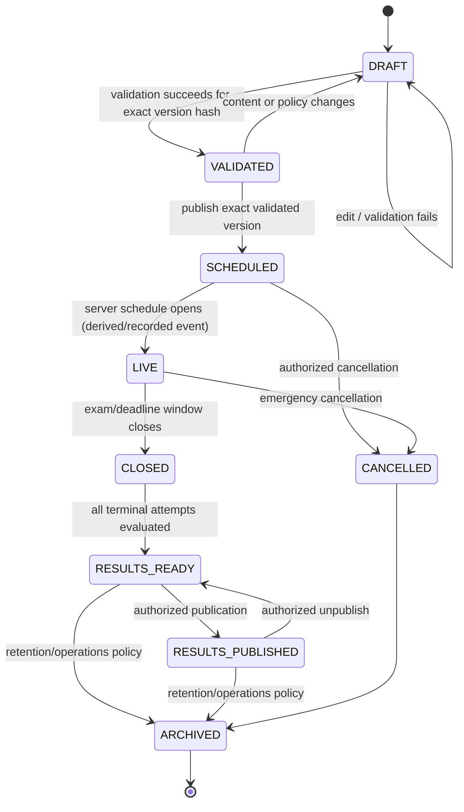
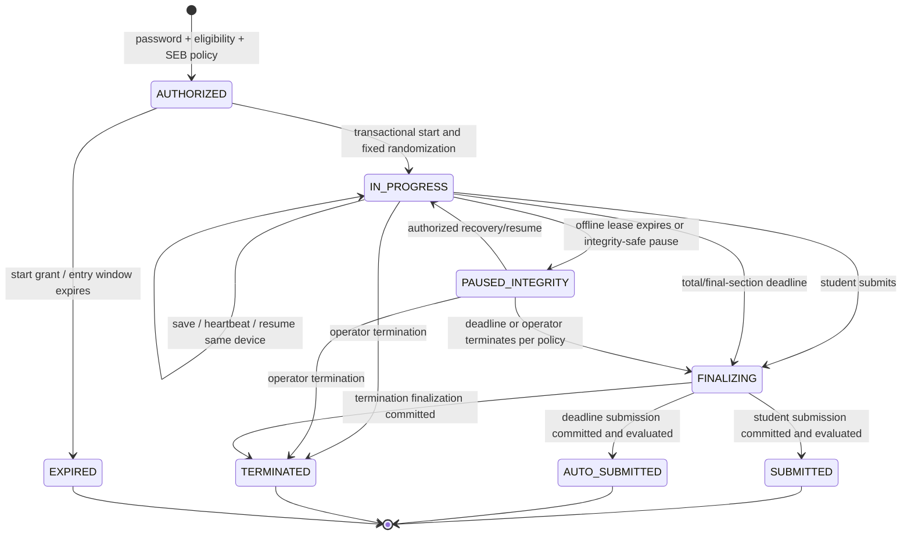
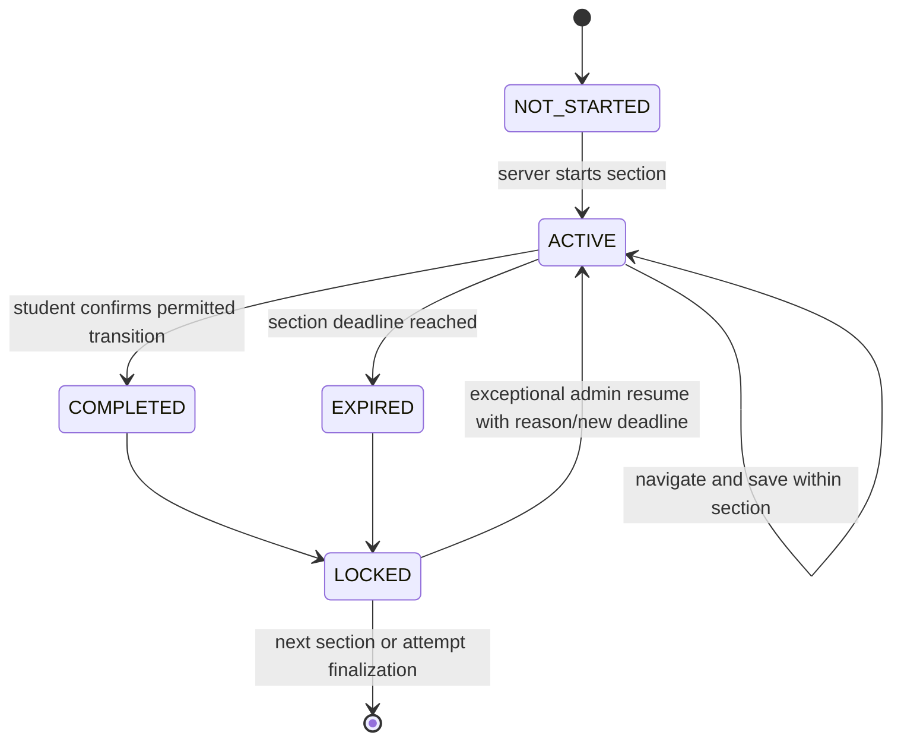

# Exam, attempt, and section state machines

State changes are server commands with authorization, expected version, idempotency key where retryable, server timestamp, actor, and audit/outbox guarantees. UI labels never cause a transition.

## Exam lifecycle

`LIVE` and `CLOSED` are predominantly schedule-derived operational states; the canonical immutable version retains dates and lifecycle events. A scheduler may materialize state for queries, but every authorization recomputes schedule eligibility from server time.

### Exam transition rules

| From -> To                         | Preconditions                                                                                                       | Effects                                                                   |
| ---------------------------------- | ------------------------------------------------------------------------------------------------------------------- | ------------------------------------------------------------------------- |
| DRAFT -> VALIDATED                 | Full validation succeeds; referenced question/media versions exist and are ready; schedule/password/timing coherent | Store validation report and content hash; no student visibility           |
| VALIDATED -> SCHEDULED             | `exams:publish`, recent step-up, hash unchanged, production readiness policy satisfied                              | Freeze version; set published pointer; audit and notification outbox      |
| Any content change before publish  | Authorized author and optimistic version                                                                            | Invalidate prior validation and return to DRAFT                           |
| SCHEDULED/LIVE -> CANCELLED        | Publish/operate authority, step-up, reason, impact confirmation                                                     | Reject new starts; define active-attempt termination policy; notify/audit |
| RESULTS_READY -> RESULTS_PUBLISHED | All intended results generated/reviewed; publication policy; authorized publisher and step-up                       | Set published result-version pointers/time; notify/audit                  |
| RESULTS_PUBLISHED -> RESULTS_READY | Exceptional authorized unpublish, reason, notification/incident policy                                              | Hide result projection; do not delete result history                      |

Published content is never edited in place. A schedule/content change creates a new version with explicit rules for attempts already authorized or started.

## Attempt lifecycle

Operational attendance labels such as `INTERRUPTED` and `RESUMED` are derived from attempt events; they need not be mutually exclusive terminal states. `FINALIZING` is a durable recovery state and accepts no candidate answer changes.

### Attempt transition rules

| Command             | Preconditions                                                                                                                                                         | Atomic effects / response                                                                                     |
| ------------------- | --------------------------------------------------------------------------------------------------------------------------------------------------------------------- | ------------------------------------------------------------------------------------------------------------- |
| Authorize           | Authenticated active student, eligible program, entry window, attempt allowance, correct password, required SEB or valid fallback grant, no conflicting active device | Short-lived authorization grant bound to user/session/exam version; generic denial on failure                 |
| Start               | Valid grant, same session/device, server time allowed, unique attempt/idempotency                                                                                     | Persist seed/order/snapshots/start and deadlines, first section, audit; return candidate-safe attempt         |
| Save                | Owner/bound device, `IN_PROGRESS`, active section, before server deadline, valid revision/sequence/lease                                                              | Conditional answer + revision/server receipt; canonical ack                                                   |
| Mark interruption   | Missed heartbeat/disconnect signal (detection may lag)                                                                                                                | Append event and expose status; timer continues                                                               |
| Pause integrity     | Server observes expired lease/reconnect or operator invokes safe pause policy                                                                                         | Freeze candidate writes and record reason/event; original deadlines continue unless later explicitly extended |
| Resume same device  | `IN_PROGRESS`, session still valid/bound, before deadline                                                                                                             | Restore canonical state/order/deadline; event only, no timer reset                                            |
| Admin resume/extend | `PAUSED_INTEGRITY` or policy-allowed state, permission, step-up, reason, bounded extension                                                                            | New binding/deadline revision, revoke predecessor where transfer, audit before/after                          |
| Submit              | Owner/bound session, permitted state, expected revision, valid idempotency                                                                                            | Acquire `FINALIZING`, freeze final revision, evaluate exactly once, terminal receipt                          |
| Auto-submit         | Server deadline reached in any request/scheduler reconciliation                                                                                                       | Same finalization with server actor and `AUTO_SUBMITTED` outcome                                              |
| Terminate           | Operator permission, step-up, reason, current active state                                                                                                            | Freeze accepted revision and terminal result/attendance policy, audit/notification                            |

## Timed section lifecycle

- At most one section is active.
- Its start and deadline are persisted server instants; reload does not recreate them.
- Default navigation is free only among the active section's questions.
- Completion/expiry locks prior section answers. A transition starts the next section atomically or finalizes the attempt.
- Administrator resume creates a new section timing revision and event; historical deadlines remain recorded.
- Total exam deadline caps any section/admin extension unless the authorized override explicitly extends both under policy.

## Race resolution

1. Server receipt and persisted state, not client event time, order conflicting commands.
2. Deadline enforcement occurs inside the same conditional write/transaction as a save or transition.
3. If save and submission race, only a save committed before the finalization compare-and-set can enter the `finalAnswerRevision`.
4. A submit retry returns the existing terminal receipt. A late save returns terminal state and cannot reopen the attempt.
5. Student submission just before a deadline may win if its transaction commits under the pre-deadline predicate; otherwise the server finalizes as auto-submitted using the last durable revision.
6. Administrator operations use expected attempt revision and fail with a reviewable conflict rather than overwriting concurrent state.

## Attendance derivation

| Attendance label | Server evidence                                                     |
| ---------------- | ------------------------------------------------------------------- |
| Not started      | No attempt start event before policy cutoff                         |
| Started          | Attempt start exists                                                |
| In progress      | Current active attempt state                                        |
| Submitted        | Student-finalized terminal state                                    |
| Auto-submitted   | Deadline-finalized terminal state                                   |
| Interrupted      | Heartbeat gap/offline event exceeds configured threshold            |
| Resumed          | Valid resume following interruption/pause                           |
| Terminated       | Operator/system terminal event                                      |
| Absent           | Entry window closed with no valid start, computed by attendance job |

An attempt may have `Interrupted`/`Resumed` history and ultimately be `Submitted`; reports should distinguish current/final status from event flags.
